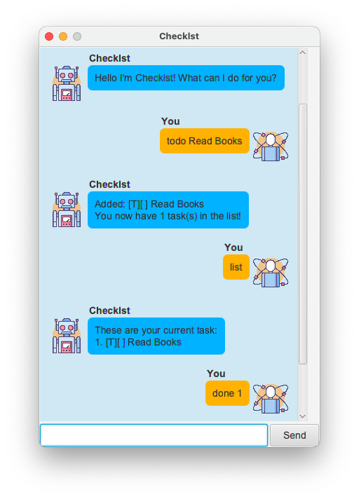
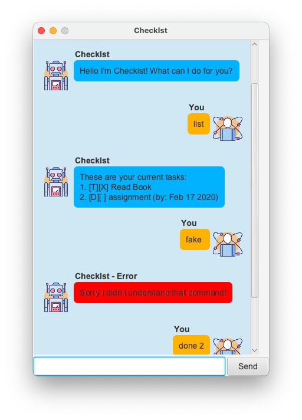

# Checklst

Checklst is a basic Todo app, allowing users to store and track events, deadlines and todos. Checklst has gradually evolved from a basic CLI application to a fully ready GUI.

# Command Syntax

| Command | Description | Example |
|--|--|--|
| `list` | Lists all Tasks | `list` |
| `todo NAME` | Creates a Todo | `todo  Read Books` |
| `event NAME /at EVENT_DATE` | Creates an Event with a specific occurrence date| `event Concert /at 2020-12-04` |
| `deadline NAME /by DUE_DATE` | Creates a Deadline with a specific due date | `deadline Assignment /by 2020-12-03` |
| `done INDEX` | Completes the Task | `done 1` | 
| `delete INDEX` | Deletes the Task | `delete 1` | 
| `find KEYWORD` | Finds all Tasks whose name contains the Keyword | `find CS2103` |
| `sort` | Sorts all Tasks by Complete/Incomplete and then Task Type | `sort` |
| `help` | Shows all Commands | `help` |
| `bye` | Exits Checklst | `bye` |

# Features

## Creating a Task
Tasks can be one of 3 types - Todo, Event and Deadline. Todos are basic named Tasks while Events and Deadlines both contain a date which corresponds to their event date and due date respectively.

Tasks can be made using commands `todo`, `event`, `deadline` to create each type of task respectively. Tasks will be labelled according to their task type in the Checklst application as follows:

| Task Command | Task Representation
|--|--|
| `todo Read Books` | [T][ ] Read Books |
| `event Concert /at 2020-12-04` | [E][ ] Concert (at: Dec 4 2020) |
| `deadline Assignment /by 2020-12-03` | [D][ ] Assignment (by: Dec 3 2020) |

## Listing Tasks and Completing a Task
Tasks can be listed using the `list` command. 

Once a Task is made, it will be by default labelled as incomplete. A task can then be completed using the `done` command to mark it as completed. The index value of the task starts from index 1 and can be referenced from the `list` command.

| Task Command | Expected Output
|--|--|
| `list` | These are your current tasks:   1. [T][ ] Read Books |
| `done 1` | [T][X] Read Books |
| `list` | These are your current tasks:   1. [T][X] Read Books |

## Deleting a Task
Tasks can be removed from Checklst by using the `delete` command. Similarly, the index value starts from index 1.

| Task Command | Expected Output
|--|--|
| `list` | These are your current tasks:   1. [T][X] Read Books |
| `delete 1` | [T][X] Read Books |
| `list` | Task list is currently empty! |

## Finding Tasks
To easily retrieve tasks when the Task List gets convoluted, the `find` command may be used with a keyword that will be matched to tasks. As long as some part of a Task's name contains the keyword, it will be returned.

| Task Command | Expected Output
|--|--|
| `list` | These are your current tasks:   1. [T][ ] Read Books   2. [T][ ] Return Books   3. [T][ ] Eat Lunch|
| `find books` | Here are the matching tasks in your list!   1. [T][ ] Read Books   2. [T][ ] Return Books |

## Sorting Tasks
Tasks are added to the bottom of the Task List via a Chronological input order. However, the tasks may be deliberately sorted on will via the `sort` command. 

The sorting will be done via 2 conditions. Firstly, the tasks will be split into complete and incomplete. Secondly, the tasks will be sorted by Task type.

| Task Command | Expected Output
|--|--|
| `list` | These are your current tasks:   1. [T][ ] Read Books   2. [E][ ] Movie (at: Apr 24 2020)   3. [T][X] Return Books   4. [E][ ] Concert (at: Feb 13 2020)  |
| `sort` | These are your current tasks:   1. [T][ ] Read Books   2. [E][ ] Movie (at: Apr 24 2020)   3. [E][ ] Concert (at: Feb 13 2020)   4. [T][X] Return Books |

## Errors
Checklst is is capable of handling errors in command or keyword inputs. Whenever an error is encounted, Checklst will return the error message with a clear red indicator.

